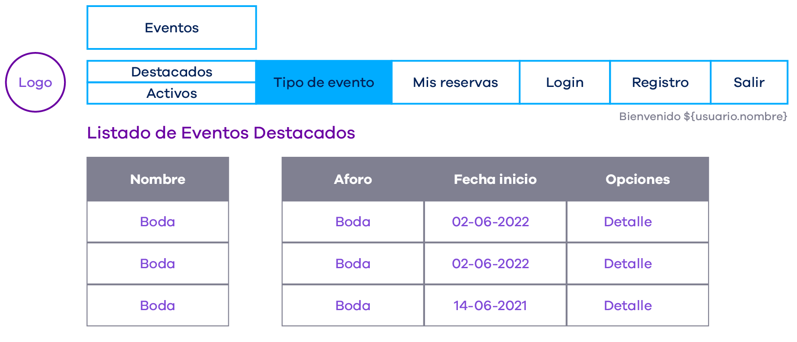
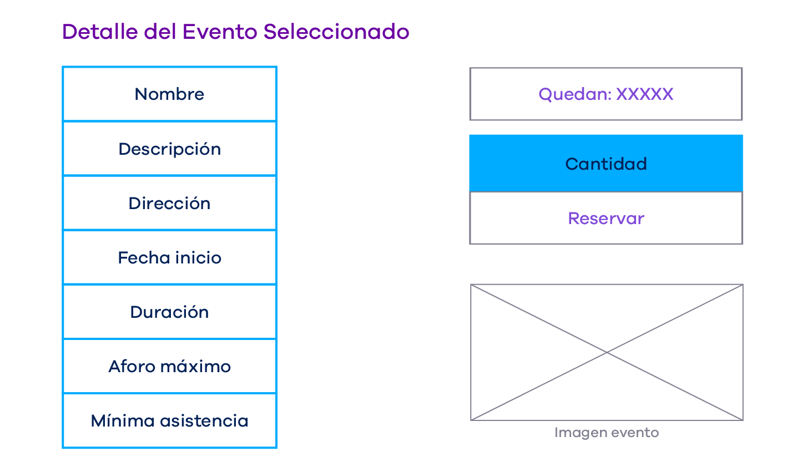

# AI-2. Controlador Gestión Clientes

## Enunciado

Tenemos una empresa que se dedica a montar eventos. A un evento se inscriben clientes, de los que debemos guardar los datos que figuran en la base de datos de usuario. Hay que tener en cuenta que un cliente puede apuntarse a más de un evento y, en cada evento, puede hacer hasta 10 reservas.

Cuando un cliente se registra le otorgamos el rol Cliente; pero, para no complicarnos en la parte de los repositorios, vamos a contemplar un solo cliente (a lo sumo dos) y no hará falta que creemos la clase de perfiles ni de usuario_perfiles.

El modelo de datos de este ejercicio es el mismo que el de los anteriores:

Cuando un cliente registrado entra a la aplicación mediante la URL “/clientes/**” ve esta pantalla, con este menú y con la lista de eventos destacados.

## Desarrollo

Casos de uso del controlador GestionClientes (URL general: “/clientes”):

- **“/login”:** sacar un formulario para logar al cliente y generar los métodos necesarios en el repositorio de cliente con el fin de que el usuario y la password sean correctos y le mostremos la pantalla que figura en la imagen anterior. Respecto al cliente, tenemos que guardarlo durante toda la sesión y su nombre debe aparecer en todas las pantallas.
- **“/cerrarSesion”:** volver al formulario de inicio sesión para pedir otro cliente (o el mismo si solo tienes uno).
- **“/activos”:** sacar el listado de todos los eventos activos y opción detalle.
- **“/destacados”:** sacar el listado de todos los eventos destacados y opción detalle.
- **“/detalle/{id}”:** con @Get mostrar un JSP con los datos del evento, y un formulario con la cantidad (máximo 10 por reserva) y un botón que ponga “reservar”.
- **“/reservar/{id} “:** dar de alta la reserva de ese evento. Posibilidades de mensajes:
  - **Todo correcto, mensaje reserva realizada.**
  - **Problemas al dar de alta, reserva no realizada.**

Nota: añadir el precio unitario en esta vista.

En la imagen del evento ponemos uno cualquiera, aunque siempre sea la misma, o no adjuntamos ninguna.

## Formato de entrega

Proyecto con software comentado a nivel de métodos en formato zip.

## Criterios de calificación

15% hacer los comentarios de cada método.

30% calidad de los elementos y componentes del programa.

15% que al montarla el tutor no tenga problemas en su equipo.

40% que la aplicación funcione bien.
